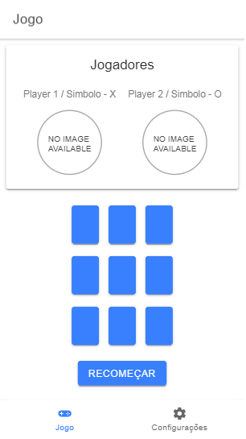
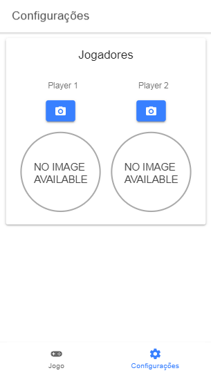

# `JOGO DA VELHA` 

Trabalho prático 3 - Aplicação Híbrida ,matéria Tópicos Especiais em Sistemas de Informação: Aplicações Híbridas.

Foram utilizadas as tecnologias Ionic e Angular para construção desta aplicação.

# Instalação

Clone o repositório disponível em:
```bash
git clone https://github.com/crashover551/JogoDaVelha.git
```
Entre na pasta clonada
```bash
cd JogoDaVelha/
```
Instale as dependencias e modulos necessários
```bash
npm install
ou
yarn install
```

# Rodando a Aplicação

### PC ###

Para rodar a aplicação do Ionic é necessário possuir instalado o Ionic em sua máquina, para isso basta rodar o seguinte comando:
```bash
npm install –g cordova ionic
```

Caso de certo você poderá verificar através do comando
```bash
ionic --version
ou
cordova -v
```

Caso tudo tenha ocorrido corretamente você deverá visualizar as versões dos componentes acima.

Feito isso basta entrar na pasta do Projeto e executar
```bash
ionic serve
```

---

### Smartphone ###

Para rodar o Projeto em um smartphone é necessário algumas instalações e configurações prévias, como no caso do Android onde é necessário a instalação e configuração do Android Studio

Para melhor explicação você pode olhar neste Guia que mostra os requisitos necessários:

> [Guia Ionic para Deploy em Dispositivos Móveis](https://ionicframework.com/docs/v3/intro/deploying/)

Feito tudo corretamente basta conectar seu dispositivo na máquina, entrar na pasta do Projeto e executar o comando:
```bash
ionic cordova run android (No caso de dispositivos Android)
```
Com isso a aplicação, ao ser finalizada a compilação, será executada diretamente no seu smartphone.


# Atendimento de Requisitos

1. Conter pelo menos duas páginas, formatadas adequadamente para smartphones:
    
    > Utilizado flex-box para adequação das telas em modo responsivo para smartphones;

2. Usar armazenamento local de dados, considerando:
   1. Os dados armazenados devem ser específicos do usuário;
   2. Os dados armazenados devem ser usados em alguma funcionalidade da aplicação:

   > 1. Foto tirada do jogador sendo específico de cada um dos usuários.
   > 2. Dados armazenados localmente, sendo estes Nome dos Jogadores atuais e foto de ambos, para fins de visualização durante o Jogo.

3. Usar pelo menos um recurso nativo, que seja relevante para alguma funcionalidade da aplicação:
    
    > Utilização do Recurso Nativo de Camera do dispositivo para captura de foto dos jogadores.

# Aplicação

<p align="center">Telas da Aplicação</p>
<p align="center">


</p>
